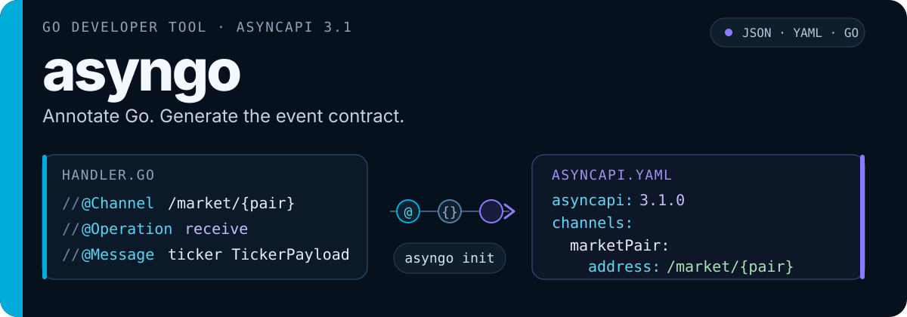

<p align="center">
  
</p>

<p align="center">
  <a href="https://github.com/polanski13/asyngo/actions/workflows/ci.yml"></a>
  <a href="https://github.com/polanski13/asyngo/releases"></a>
  <a href="https://github.com/polanski13/asyngo/blob/main/go.mod"></a>
  <a href="https://www.asyncapi.com/docs/reference/specification/v3.1.0"></a>
  <a href="#license"></a>
</p>

<p align="center">
  <a href="#quick-start">Quick start</a> ·
  <a href="#what-it-models">What it models</a> ·
  <a href="#cli">CLI</a> ·
  <a href="#reference">Reference</a> ·
  <a href="./CHANGELOG.md">Changelog</a>
</p>

---

`asyngo` generates AsyncAPI 3.1 documents from the Go comments and structs that implement your WebSocket or event-driven API. The code stays authoritative; JSON, YAML, and embeddable Go output are generated from it.

## Quick start

Requires Go 1.25 or later.

### Install

```bash
go install github.com/polanski13/asyngo/cmd/asyngo@latest
```

### Annotate

Add API metadata to your main file and channel metadata to a handler:

```go
// @AsyncAPI 3.1.0
// @Title Trading WebSocket API
// @Version 1.0.0
// @Server production wss://ws.example.com /v1 "Production"
func main() {}

// @Channel /market/{pair}
// @ChannelParam pair string true "Trading pair"
// @Operation receive
// @OperationID receiveMarketData
// @Message tickerUpdate TickerPayload
func HandleMarket() {}
```

Payload schemas come from ordinary Go structs and tags:

```go
type TickerPayload struct {
    Symbol string    `json:"symbol" validate:"required" example:"BTC-USD"`
    Price  float64   `json:"price" minimum:"0"`
    Side   string    `json:"side" enum:"buy,sell"`
    Time   time.Time `json:"timestamp"`
}
```

### Generate

```bash
asyngo init --dir . --output ./docs --strict
```

`asyngo` writes `asyncapi.json` and `asyncapi.yaml`:

```yaml
asyncapi: 3.1.0
channels:
  marketPair:
    address: /market/{pair}
    messages:
      tickerUpdate:
        $ref: '#/components/messages/tickerUpdate'
operations:
  receiveMarketData:
    action: receive
    channel:
      $ref: '#/channels/marketPair'
```

The repository CI generates contracts from the included basic and polymorphic examples, then validates both with the official AsyncAPI CLI.

## Why asyngo

- **Keep one source of truth.** Channels, messages, bindings, and schemas stay beside their Go handlers and types.
- **Model event-driven behavior.** Describe send and receive operations, replies, WebSocket bindings, polymorphic messages, and security schemes.
- **Generate AsyncAPI 3.1.** Output uses JSON Schema Draft 07 and can be emitted as JSON, YAML, or an embeddable Go package.
- **Fail CI on contract problems.** Strict mode promotes parser warnings to errors and validates references before writing output.

### Where it fits

| Tool | Direction | Use it when |
|---|---|---|
| **asyngo** | Go annotations → AsyncAPI 3.1 | Go code is authoritative for an event-driven API |
| [`swaggo/swag`](https://github.com/swaggo/swag) | Go annotations → Swagger 2.0 | Go code is authoritative for a REST API |
| [`asyncapi-codegen`](https://github.com/lerenn/asyncapi-codegen) | AsyncAPI document → Go | An existing AsyncAPI document is authoritative |

## What it models

### Polymorphic messages

Use `@MessageOneOf` when a channel carries multiple payload shapes:

```go
// @Channel /events/{symbol}
// @Operation receive
// @OperationID receiveEvents
// @MessageOneOf eventUpdate TickerPayload|OrderBookPayload|TradePayload discriminator(eventType)
func HandleEvents() {}
```

The generated payload contains `oneOf` references and a discriminator.

### Request and reply

```go
// @Channel /market/{pair}
// @Operation send
// @OperationID sendSubscription
// @Message subscribe SubscribeRequest
// @Reply
// @ReplyMessage subscriptionAck SubscriptionAck
// @ReplyChannel /market/{pair}
func HandleSubscription() {}
```

### Security schemes

Declare schemes at the API level and reference them from operations:

```go
// @SecurityScheme bearerAuth http bearer JWT "Bearer token"
func main() {}

// @Channel /account/events
// @Operation receive
// @OperationID receiveAccountEvents
// @Security bearerAuth
// @Message accountUpdate AccountPayload
func HandleAccountEvents() {}
```

Supported scheme types include `http`, `apiKey`, `httpApiKey`, and `openIdConnect`.

## CLI

```text
asyngo init [flags]

Flags:
  -d, --dir strings          Directories to search (default [.])
      --main string          Go file with general API annotations (default "main.go")
  -o, --output string        Output directory (default "./docs")
      --outputTypes strings  Output types: json, yaml, go (default [json,yaml])
      --exclude strings      Directories to exclude
      --strict               Treat warnings as errors
```

Multiple directories and output types use comma-separated values:

```bash
asyngo init \
  --dir ./cmd/server,./internal/realtime \
  --exclude ./internal/generated,./vendor \
  --outputTypes yaml,go \
  --strict
```

Selecting `go` also writes `asyncapi.json` so the generated package can embed it.

## Programmatic usage

```go
package docs

import (
    "github.com/polanski13/asyngo"
    "github.com/polanski13/asyngo/gen"
)

func Generate() error {
    return asyngo.Generate(&gen.Config{
        SearchDirs:  []string{"."},
        MainAPIFile: "main.go",
        OutputDir:   "./docs",
        OutputTypes: []string{"json", "yaml"},
        Strict:      true,
    })
}
```

## Reference

<details>
<summary><strong>General API annotations</strong></summary>

| Annotation | Description |
|---|---|
| `@AsyncAPI` | AsyncAPI version, for example `3.1.0` |
| `@Title` | API title |
| `@Version` | API version |
| `@Description` | API description; continuation lines are supported |
| `@DefaultContentType` | Default content type |
| `@ID` | Unique document identifier |
| `@TermsOfService` | Terms of service URL |
| `@Contact.Name` | Contact name |
| `@Contact.Email` | Contact email |
| `@Contact.URL` | Contact URL |
| `@License.Name` | License name |
| `@License.URL` | License URL |
| `@ExternalDocs.Description` | External documentation description |
| `@ExternalDocs.URL` | External documentation URL |
| `@Server` | `name host pathname "description"` |
| `@SecurityScheme` | `name type [type-specific arguments] ["description"]` |

</details>

<details>
<summary><strong>Channel and operation annotations</strong></summary>

| Annotation | Description |
|---|---|
| `@Channel` | Channel address, for example `/market/{pair}` |
| `@ChannelDescription` | Channel description |
| `@ChannelParam` | `name type required "description"` |
| `@ChannelServer` | Associate the channel with a named server |
| `@WsBinding.Method` | WebSocket HTTP method: `GET` or `POST` |
| `@WsBinding.Query` | `name type required "description"` |
| `@WsBinding.Header` | `name type required "description"` |
| `@Operation` | Operation action: `send` or `receive` |
| `@OperationID` | Unique operation identifier |
| `@Summary` | Operation summary |
| `@Description` | Operation description |
| `@Tags` | Comma-separated tags |
| `@Message` | `name PayloadType` |
| `@MessageOneOf` | `name Type1\|Type2 [discriminator(property)]` |
| `@Reply` | Mark the operation as having a reply |
| `@ReplyMessage` | `name PayloadType` |
| `@ReplyChannel` | Reply channel address |
| `@Security` | Security scheme reference |

</details>

<details>
<summary><strong>Struct tags</strong></summary>

| Tag | Description | Example |
|---|---|---|
| `json` | JSON field name; use `-` to skip | `json:"name"` |
| `validate` | Validation rules | `validate:"required,min=1"` |
| `binding` | Alternative required-field marker | `binding:"required"` |
| `example` | Example value | `example:"BTC-USD"` |
| `enum` | Comma-separated enum values | `enum:"buy,sell"` |
| `minimum` | Minimum numeric value | `minimum:"0"` |
| `maximum` | Maximum numeric value | `maximum:"100"` |
| `format` | JSON Schema format | `format:"email"` |
| `pattern` | Regular expression | `pattern:"^[a-z]+$"` |
| `default` | Default value | `default:"auto"` |
| `asyncapiignore` | Exclude the field from its schema | `asyncapiignore:"true"` |

</details>

<details>
<summary><strong>Go type mapping</strong></summary>

| Go type | Generated JSON Schema |
|---|---|
| `string` | `string` |
| `int`, `int8`…`int64`, `uint`…`uint64` | `integer` |
| `float32`, `float64` | `number` |
| `bool` | `boolean` |
| `time.Time` | `string`, format `date-time` |
| `uuid.UUID` | `string`, format `uuid` |
| `[]byte` | `string`, format `byte` |
| `[]T` | `array` with `T` items |
| `map[string]T` | `object` with `T` values |
| `*T` | `oneOf` with `T` and `null` |
| Embedded struct | Fields flattened into the parent |
| `any`, `interface{}` | Unconstrained schema |

Generic type instantiations are supported. Type parameters inside a generic struct resolve to an unconstrained schema.

</details>

## Protocols and channel merging

Supported server protocols:

`wss://` · `ws://` · `https://` · `http://` · `mqtt://` · `amqp://` · `kafka://`

When a server host has no protocol prefix, `ws` is used.

Multiple handlers may annotate the same `@Channel` address. `asyngo` merges their messages, parameters, servers, and WebSocket bindings into one channel definition. Conflicting WebSocket bindings produce a warning, which becomes an error in strict mode.

## Development

```bash
go test ./...
go vet ./...
go build ./...
```

## License

MIT
